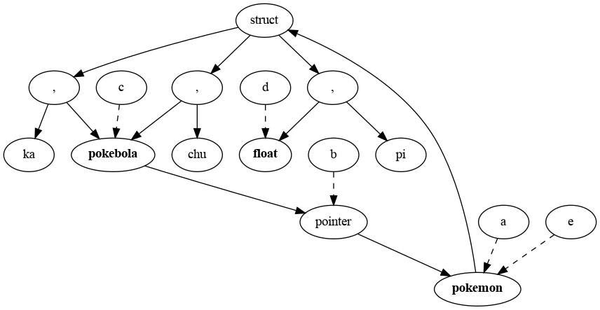
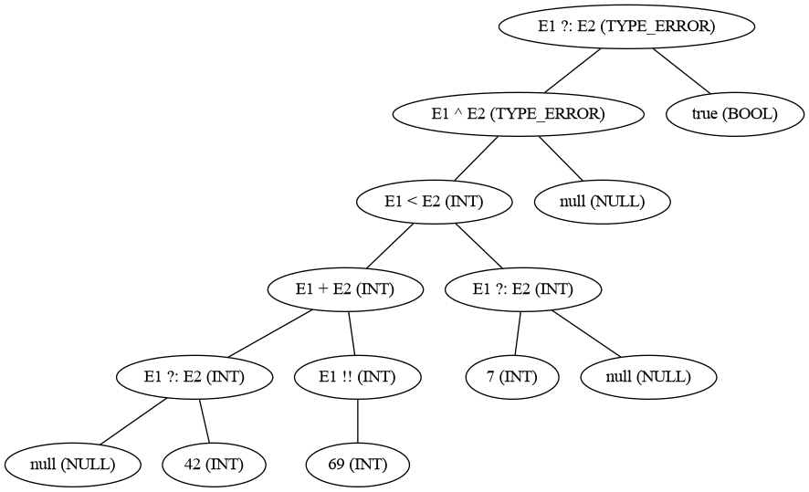

# Respuestas

## Pregunta 1



## Pregunta 2

### A
```
PUSH 0
LVALUE s
ASSIGN

PUSH 0
LVALUE i
ASSIGN

Loop:
RVALUE i
PUSH 10
LT
GOFALSE Out

RVALUE i
RVALUE i
MUL
PUSH 2
DIV
RVALUE s
ADD
LVALUE s
ASSIGN

RVALUE i
PUSH 1
ADD
LVALUE i
ASSIGN
GOTO Loop

Out:
```
### B

```
S := 0
I := 0

Loop:
If I >= 10 goto Out

T1 := I * I
T2 := T1 / 2
T3 := s + T2
S := T3
T4 := I + 1
I = T4

Goto loop
Out:
```

## Pregunta 3

### A
```
E   → E1 + E2   { E.type ← if(E1.type == int ∧ E2.type == int) then int else type_error }
    | E1 ∧ E2   {E.type ← if(E1.type == bool ∧ E2.type == bool) then bool else type_error}
    | E1 < E2	{ E.type ← if(E1.type == int ∧ E2.type == int) then bool else type_error }
    | E1 ?: E2	{ E.type ← if (E1 != null) then E1.type else E2.type }
    | E1 !!		{ E.type ← if (E1 != null) then E1.type else type_error}
    | (E1)		{ E.type ← E1.type }
    | num		{ E.type ← int }
    | true		{ E.type ← bool }
    | false		{ E.type ← bool }
    | null		{ E.type ← null }
```

### B



### C
```
S → repeatWhen E1 lt S1 gt S2   { S.type ← if (E1.type == int ∧ E1 < 0) then S1.type
                                            Else if (E1.type == int ∧ E1 > 0) then S2.type
                                            Else if (E1.type == int ∧ E1 == 0) then void
                                            Else type_error}
```