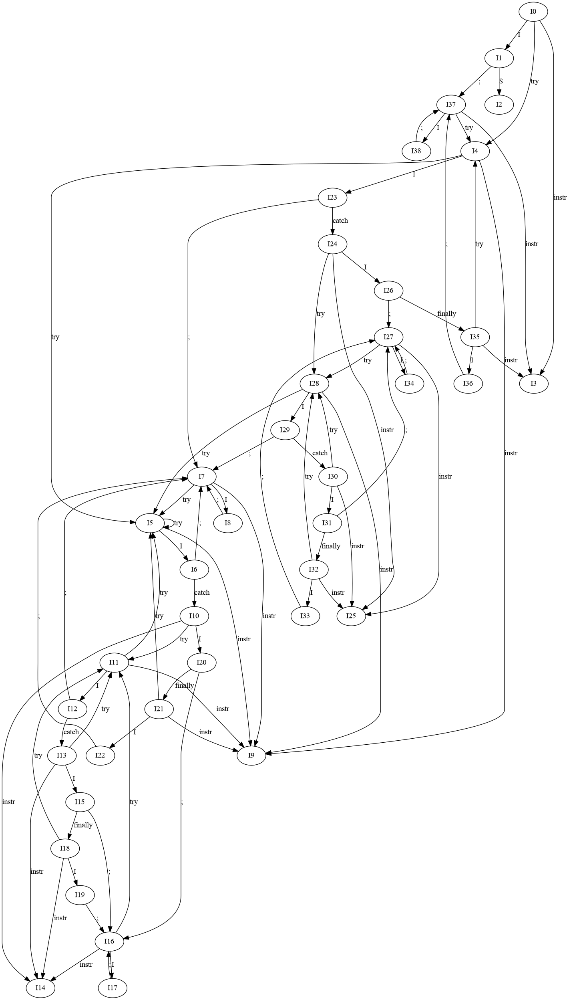
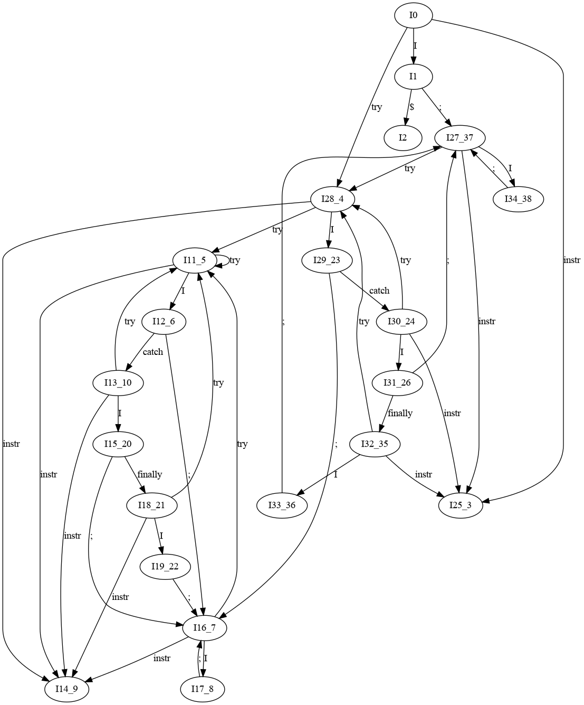
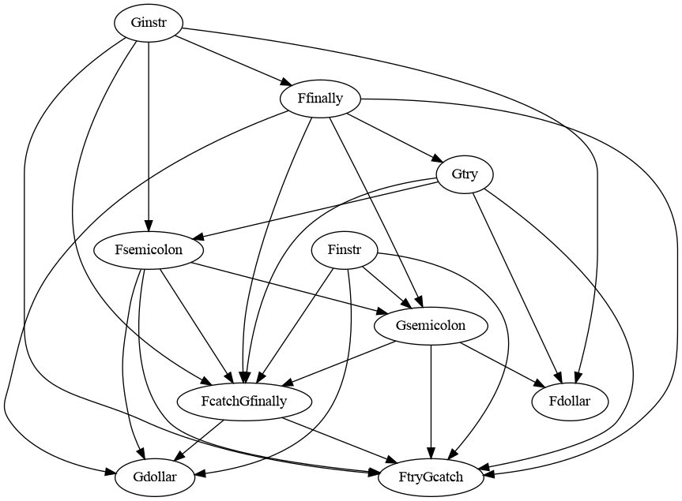

# CI4721_LenguajesII_Exams

## 1. (6 puntos) Sea una gramatica EXCEP T = ({instr, ;, try, catch, f inally}, {I}, P, I), con P definido de la siguiente manera:

```
    I → try I catch I f inally I
        | try I catch I
        | I ; I
        | instr
```

Esto representa instrucciones con bloques protegidos (try) y manejadores de excepciones (catch), que opcionalmente tienen una instruccion que se ejecuta en cualquier caso, ya sea que ocurriera la excepcion o no
(finally).

### a) (3 puntos) Aumente la gramatica con un nuevo sımbolo inicial no recursivo S, construya la maquina caracterıstica LR(1) y diga si existen conflictos en el mismo.

```
LR(1)
```
```
I0:
S →	    . I , 				        {$}
I → 	. try I catch I finally I, 	{$, ;}
| 	    . try I catch I,			{$, ;}
| 	    . I ; I,				    {$, ;}
| 	    . instr,				    {$, ;}
```
```
I1: leer I (desde I0):
S →	    I . , 				        {$}
I →	    I . ; I,				    {$, ;}
```
```
I2: leer $ (desde I1):
S →     I $.				        {$}
```
```
I3: leer instr (desde I0, I35, I37):
I →	    instr . ,				    {$, ;}
```
```
I4: leer try (desde I0, I37, I35)
I → 	try . I catch I finally I, 	{$, ;}
| 	    try . I catch I,			{$, ;}

I → 	. try I catch I finally I, 	{catch, ;}
| 	    . try I catch I,			{catch, ;}
| 	    . I ; I,				    {catch, ;}
| 	    . instr,				    {catch, ;}
```
```
I5: leer try (desde I4, I5, I7, I11, I21, I28)
I → 	try . I catch I finally I, 	{catch, ;}
|       try . I catch I,			{catch, ;}

I →     . try I catch I finally I, 	{catch, ;}
| 	    . try I catch I,			{catch, ;}
| 	    . I ; I,				    {catch, ;}
| 	    . instr,				    {catch, ;}
```
```
I6: leer I (desde I5)
I → 	try  I . catch I finally I, {catch, ;}
| 	    try  I . catch I,			{catch, ;}
|       I . ; I,				    {catch, ;}
```
```
I7: leer ; (desde, I6, I8, I12, I22, I23, I29):
I → 	I ; . I,				    {catch, ;}
I → 	. try I catch I finally I, 	{catch, ;}
| 	    . try I catch I,			{catch, ;}
| 	    . I ; I,				    {catch, ;}
| 	    . instr,				    {catch, ;}
```
```
I8: leer I (desde I7): SHIFT/REDUCE
I → 	I ; I .,				    {catch, ;}
| 	    I . ; I,				    {catch, ;}
```
```
I9: leer instr (desde I7, I11, I4, I5, I21, I28)
I →	    instr .,				    {catch, ;}
```
```
I10: leer catch (desde I6):
I → 	try  I catch . I finally I, 	{catch, ;}
| 	    try  I catch . I,			    {catch, ;}

I → 	. try I catch I finally I, 	{finally, catch, ;}
| 	    . try I catch I,			{finally, catch, ;}
| 	    . I ; I,				    {finally, catch, ;}
| 	    . instr,				    {finally, catch, ;}
```
```
I11: leer try (desde I10, I13, I16, I18):
I → 	try . I catch I finally I, 	{finally, catch, ;}
| 	    try . I catch I,			{finally, catch, ;}

I → 	. try I catch I finally I, 	{catch, ;}
| 	    . try I catch I,			{catch, ;}
| 	    . I ; I,				    {catch, ;}
| 	    . instr,				    {catch, ;}
```
```
I12: leer I (desde I11)
I → 	try I . catch I finally I, 	{finally, catch, ;}
| 	    try I . catch I,			{finally, catch, ;}
| 	    I . ; I,				    {catch, ;}
```
```
I13: leer catch (desde I12)
I → 	try I catch . I finally I, 	{finally, catch, ;}
| 	    try I catch . I,			{finally, catch, ;}

I → 	. try I catch I finally I, 	{finally, catch, ;}
| 	    . try I catch I,			{finally, catch, ;}
| 	    . I ; I,				    {finally, catch, ;}
| 	    . instr,				    {finally, catch, ;}
```
```
I14: leer instr (desde I13, I16, I18, I10):
I →     instr .,				    {finally, catch, ;}
```
```
I15: leer I (desde I13): SHIFT/REDUCE
I → 	try I catch I . finally I, 	{finally, catch, ;}
| 	    try I catch I .,			{finally, catch, ;}
| 	    I . ; I,				    {finally, catch, ;}
```
```
I16: leer ; (desde I15, I17, I19, I20):
I → 	I ; . I,				{finally, catch, ;}

I → 	. try I catch I finally I, 	{finally, catch, ;}
| 	    . try I catch I,			{finally, catch, ;}
| 	    . I ; I,				    {finally, catch, ;}
| 	    . instr,				    {finally, catch, ;}
```
```
I17: leer I (desde I16): SHIFT/REDUCE
I → 	I ; I .,				{finally, catch, ;}
| 	    I . ; I,				{finally, catch, ;}
```
```
I18: leer finally (desde I15):
I → 	try I catch I finally . I, 	{finally, catch, ;}

I → 	. try I catch I finally I, 	{finally, catch, ;}
| 	    . try I catch I,			{finally, catch, ;}
| 	    . I ; I,				    {finally, catch, ;}
| 	    . instr,				    {finally, catch, ;}
```
```
I19: leer I (desde I18):	SHIFT/REDUCE
I → 	try I catch I finally I ., 	{finally, catch, ;}
| 	    I . ; I,				    {finally, catch, ;}
```
```
I20: leer I (desde I10):
I → 	try  I catch I . finally I, 	{catch, ;}
| 	    try  I catch I .,			    {catch, ;}
| 	    I . ; I,				        {finally, catch, ;}
```
```
I21: leer finally (desde I20):
I → 	try  I catch I finally . I, 	{catch, ;}

I → 	. try I catch I finally I, 	{catch, ;}
| 	    . try I catch I,			{catch, ;}
| 	    . I ; I,				    {catch, ;}
| 	    . instr,				    {catch, ;}
```
```
I22: leer I (desde I21):
I → 	try  I catch I finally I ., 	{catch, ;}
| 	    I . ; I,				        {catch, ;}
```
```
I23: leer I (desde I4)
I → 	try I . catch I finally I, 	{$, ;}
| 	    try I . catch I,			{$, ;}

| 	    I . ; I,				    {catch, ;}
```
```
I24: leer catch (desde I23):
I → 	try I catch . I finally I, 	{$, ;}
| 	    try I catch . I,			{$, ;}

I → 	. try I catch I finally I, 	{finally, $, ;}
| 	    . try I catch I,			{finally, $, ;}
|   	. I ; I,				    {finally, $, ;}
| 	    . instr,				    {finally, $, ;}
```
```
I25: leer instr (desde I24, I27, I32, I30):
I → 	instr .,				    {finally, $, ;}
```
```
I26: leer I (desde I24): SHIFT/REDUCE
I → 	try I catch I . finally I, 	{$, ;}
| 	    try I catch I .,			{$, ;}

| 	    I . ; I,				    {finally, $, ;}
```
```
I27: leer ; (desde I26, I31, I33, I34):
I → 	I ; . I,				{finally, $, ;}

I → 	. try I catch I finally I, 	{finally, $, ;}
| 	    . try I catch I,			{finally, $, ;}
| 	    . I ; I,				    {finally, $, ;}
| 	    . instr,				    {finally, $, ;}
```
```
I28: leer try (desde I24, I27, I30, I32):
I → 	try . I catch I finally I, 	{finally, $, ;}
| 	    try . I catch I,			{finally, $, ;}

I → 	. try I catch I finally I, 	{catch, ;}
| 	    . try I catch I,			{catch, ;}
| 	    . I ; I,				    {catch, ;}
| 	    . instr,				    {catch, ;}
```
```
I29: leer I (desde I28)
I → 	try I . catch I finally I, 	{finally, $, ;}
| 	    try I . catch I,			{finally, $, ;}

I →	I . ; I,				        {catch, ;}
```
```
I30: leer catch (desde I29):
I → 	try I catch . I finally I, 	{finally, $, ;}
| 	    try I catch . I,			{finally, $, ;}

I → 	. try I catch I finally I, 	{finally, $, ;}
| 	    . try I catch I,			{finally, $, ;}
| 	    . I ; I,				    {finally, $, ;}
| 	    . instr,				    {finally, $, ;}
```
```
I31: leer I (desde I30): SHIFT/REDUCE
I → 	try I catch I . finally I, 	{finally, $, ;}
| 	    try I catch I .,			{finally, $, ;}

I →  	I . ; I,				    {finally, $, ;}
```
```
I32: leer finally (desde I31):
I →     try I catch I finally . I, 	{finally, $, ;}

I → 	. try I catch I finally I, 	{finally, $, ;}
|   	. try I catch I,			{finally, $, ;}
| 	    . I ; I,				    {finally, $, ;}
|   	. instr,				    {finally, $, ;}
```
```
I33: leer I (desde I32): SHIFT/REDUCE
I → 	try I catch I finally I ., 	{finally, $, ;}

I → 	I . ; I,				    {finally, $, ;}

I34: leer I (desde I27): SHIFT/REDUCE
I → 	I ; I .,			    	{finally, $, ;}

I → 	I . ; I,			    	{finally, $, ;}
```
```
I35: leer finally (desde I26):
I →     try I catch I finally . I, 	{$, ;}

I → 	. try I catch I finally I, 	{$, ;}
| 	    . try I catch I,			{$, ;}
|   	. I ; I,				    {$, ;}
|   	. instr,				    {$, ;}
```
```
I36: leer I (desde I35): SHIFT/REDUCE
I → 	try I catch I finally I ., 	{$, ;}

I → 	I . ; I,				    {$, ;}
```
```
I37: leer ; (desde I36, I38, I1):
I → 	I ; . I,				    {$, ;}

I → 	. try I catch I finally I, 	{$, ;}
| 	    . try I catch I,			{$, ;}
| 	    . I ; I,				    {$, ;}
|   	. instr,				    {$, ;}
```
```
I38: leer I (desde I37): SHIFT/REDUCE
I → 	I ; I .,				    {$, ;}
| 	    I . ; I,				    {$, ;}
```



```
Conflictos:

I8  → Reduce
I15 → Shift 1, Shift 2
I17 → Reduce
I19 → Reduce
I20 → Shift
I22 → Reduce
I26 → Shift
I31 → Shift 1, Shift 2
I33 → Reduce
I34 → Reduce
I36 → Reduce
I38 → Reduce
```

### b) (1 punto) Tome en consideracion las siguientes reglas:

|Regla|Ejemplo|
|---|---|
|; asocia a izquierda|I ; I ; I = (I ; I) ; I|
|finally se asocia al try mas interno.|try I catch try I catch I f inally I = try I catch (try I catch I f inally I)|
|finally tiene mayor precedencia que ;|I ; try I catch I finally I ; I = I ; (try I catch I f inally I) ; I|
|catch tiene menor precedencia que ;.|try I catch I ; I = try I catch (I ; I)|

### En caso de haber conflictos en el automata de prefijos viables LR(1), diga como resolverıa los conflictos (seleccionando una de las acciones que conforma dicho conflicto), de tal forma que las reglas anteriores sean satisfechas.


### c) (2 puntos) A partir de las respuestas anteriores, construya la maquina caracterıstica LALR(1) y diga si existen conflictos en el mismo. En caso de existir, explique como los resolverıa (seleccionando una de las acciones que conforma dicho conflicto), con las mismas reglas de la pregunta anterior.

```
LALR(1)
```
```
I0:
S →	    . I , 				        {$}
I → 	. try I catch I finally I, 	{$, ;}
| 	    . try I catch I,			{$, ;}
| 	    . I ; I,				    {$, ;}
| 	    . instr,				    {$, ;}
```
```
I1: leer I (desde I0):
S →	    I . , 				        {$}
I  →	I . ; I,				    {$, ;}
```
```
I2: leer $ (desde I2):
S →	    I $.				        {$}
```
```
I11-5: leer try (desde I13-10, I16-7, I18-21, I28-4, I11-5):
I → 	try . I catch I finally I, 	{finally, catch, ;}
| 	    try . I catch I,			{finally, catch, ;}

I → 	. try I catch I finally I, 	{catch, ;}
| 	    . try I catch I,			{catch, ;}
| 	    . I ; I,				    {catch, ;}
| 	    . instr,				    {catch, ;}
```
```
I12-6: leer I (desde I11-5)
I → 	try I . catch I finally I, 	{finally, catch, ;}
| 	    try I . catch I,			{finally, catch, ;}
|   	I . ; I,				    {catch, ;}
```
```
I13-10: leer catch (desde I12-6)
I → 	try I catch . I finally I, 	{finally, catch, ;}
| 	    try I catch . I,			{finally, catch, ;}

I → 	. try I catch I finally I, 	{finally, catch, ;}
| 	    . try I catch I,			{finally, catch, ;}
| 	    . I ; I,				    {finally, catch, ;}
| 	    . instr,				    {finally, catch, ;}
```
```
I14-9: leer instr (desde I13-10, I16-7, I18-21, I11-5, I28-4):
I →	    instr .,				    {finally, catch, ;}
```
```
I15-20: leer I (desde I13-10): SHIFT/REDUCE
I → 	try I catch I . finally I, 	{finally, catch, ;}
| 	    try I catch I .,			{finally, catch, ;}
| 	    I . ; I,				    {finally, catch, ;}
```
```
I16-7: leer ; (desde I15-20, I17-8, I19-22, I12-6, I29-23):
I → 	I ; . I,				    {finally, catch, ;}
```
```
I → 	. try I catch I finally I, 	{finally, catch, ;}
| 	    . try I catch I,			{finally, catch, ;}
| 	    . I ; I,				    {finally, catch, ;}
| 	    . instr,				    {finally, catch, ;}
```
```
I17-8: leer I (desde I16-7): SHIFT/REDUCE
I → 	I ; I .,				{finally, catch, ;}
|       I . ; I,				{finally, catch, ;}
```
```
I18-21: leer finally (desde I15-20):
I → 	try I catch I finally . I, 	{finally, catch, ;}

I → 	. try I catch I finally I, 	{finally, catch, ;}
| 	    . try I catch I,			{finally, catch, ;}
| 	    . I ; I,				    {finally, catch, ;}
| 	    . instr,				    {finally, catch, ;}
```
```
I19-22: leer I (desde I18-21):	SHIFT/REDUCE
I → 	try I catch I finally I ., 	{finally, catch, ;}
| 	    I . ; I,				    {finally, catch, ;}
```
```
I25-3: leer instr (desde I30-24, I27-37, I32-35, I0):
I → 	instr .,				    {finally, $, ;}
```
```
I27-37: leer ; (desde I31-26, I33-36, I34-38, I1):
I → 	I ; . I,				    {finally, $, ;}
```
```
I → 	. try I catch I finally I, 	{finally, $, ;}
| 	    . try I catch I,			{finally, $, ;}
| 	    . I ; I,				    {finally, $, ;}
| 	    . instr,				    {finally, $, ;}
```
```
I28-4: leer try (desde I30-24, I27-37, I32-35, I0):
I → 	try . I catch I finally I, 	{finally, $, ;}
| 	    try . I catch I,			{finally, $, ;}

I → 	. try I catch I finally I, 	{catch, ;}
| 	    . try I catch I,			{catch, ;}
| 	    . I ; I,				    {catch, ;}
| 	    . instr,				    {catch, ;}
```
```
I29-23: leer I (desde I28-4)
I → 	try I . catch I finally I, 	{finally, $, ;}
| 	    try I . catch I,			{finally, $, ;}

I →	    I . ; I,				    {catch, ;}
```
```
I30-24: leer catch (desde I29-23):
I → 	try I catch . I finally I, 	{finally, $, ;}
|       try I catch . I,			{finally, $, ;}

I → 	. try I catch I finally I, 	{finally, $, ;}
| 	    . try I catch I,			{finally, $, ;}
| 	    . I ; I,				    {finally, $, ;}
| 	    . instr,				    {finally, $, ;}
```
```
I31-26: leer I (desde I30-24): SHIFT/REDUCE
I → 	try I catch I . finally I, 	{finally, $, ;}
|       try I catch I .,			{finally, $, ;}

I →  	I . ; I,				    {finally, $, ;}
```
```
I32-35: leer finally (desde I31-26):
I →     try I catch I finally . I, 	{finally, $, ;}

I →     . try I catch I finally I, 	{finally, $, ;}
| 	    . try I catch I,			{finally, $, ;}
| 	    . I ; I,				    {finally, $, ;}
| 	    . instr,				    {finally, $, ;}
```
```
I33-36: leer I (desde I32-35): SHIFT/REDUCE
I → 	try I catch I finally I ., 	{finally, $, ;}

I → 	I . ; I,				    {finally, $, ;}
```
```

I34-38: leer I (desde I27-37): SHIFT/REDUCE
I → 	I ; I .,				    {finally, $, ;}

I → 	I . ; I,				    {finally, $, ;}
```



```
Conflictos:

I15-20 → Shift 1, Shift 2
I17-8  → Reduce
I19-22 → Reduce
I31-26 → Shift 1, Shift 2
I33-36 → Reduce
I34-38 → Reduce
```

## 2. (5 puntos) Considerando la misma gramatica de la pregunta anterior:

### a) (2 puntos) Proponga una Relacion de Precedencia de Operadores entre los sımbolos terminales de la gramatica que permita resolver los conflictos con la misma suposicion que en las preguntas anteriores


|   |try|catch|finally|instr|;|$|
|---|---|---|---|---|---|---|
|try|⋖|≐||⋖|⋖||
|catch|⋖|⋗|≐|⋖|⋖|⋗|
|finally|⋗|⋗|⋗|⋖|⋗||
|instr||⋗|⋗||⋗|⋗|
|;|⋖|⋗|⋗|⋖|⋗|⋗|
|$|⋖|||⋖|⋖||

### b) (1.5 puntos) Use el reconocedor para reconocer la frase:  

    “ instr ; try instr catch instr ; try instr catch instr f inally instr ; instr ”

$ `⋖instr⋗` ; ⋖ try ⋖instr⋗ catch ⋖instr⋗ ; ⋖ try ⋖ instr ⋗ catch ⋖ instr ⋗ finally ⋖instr⋗ ; ⋖instr⋗ $  

    Acción: ubicar, reducir I → instr, reemplazar

$ ⋖ ; ⋖ try `⋖instr⋗` catch ⋖instr⋗ ; ⋗ try ⋖ instr ⋗ catch ⋖ instr ⋗ finally ⋖instr⋗ ; ⋖instr⋗ $  

    Acción: ubicar, reducir I → instr, reemplazar

$ ⋖ ; ⋖ try ≐ catch `⋖instr⋗` ; ⋗ try ⋖ instr ⋗ catch ⋖ instr ⋗ finally ⋖instr⋗ ; ⋖instr⋗ $  

    Acción: ubicar, reducir I → instr, reemplazar

$ ⋖ ; ⋖ try ≐ catch `⋖ ; ⋗` try ⋖ instr ⋗ catch ⋖ instr ⋗ finally ⋖instr⋗ ; ⋖instr⋗ $  

    Acción: ubicar, reducir I → I ; I, reemplazar

$ ⋖ ; ⋖ try ≐ catch ⋖ try `⋖ instr ⋗` catch ⋖ instr ⋗ finally ⋖instr⋗ ; ⋖instr⋗ $  

    Acción: ubicar, reducir I → instr, reemplazar

$ ⋖ ; ⋖ try ≐ catch ⋖ try ≐ catch `⋖ instr ⋗` finally ⋖instr⋗ ; ⋖instr⋗ $  

    Acción: ubicar, reducir I → instr, reemplazar

$ ⋖ ; ⋖ try ≐ catch ⋖ try ≐ catch ≐ finally `⋖instr⋗` ; ⋖instr⋗ $  

    Acción: ubicar, reducir I → instr, reemplazar

$ ⋖ ; ⋖ try ≐ catch `⋖ try ≐ catch ≐ finally  ⋗` ; ⋖instr⋗ $

    Acción: ubicar, reducir I → try I catch I finally I, reemplazar

$ ⋖ ; ⋖ try ≐ catch ⋖ ; `⋖instr⋗` $  

    Acción: ubicar, reducir I → instr, reemplazar

$ ⋖ ; ⋖ try ≐ catch `⋖ ; ⋗` $

    Acción: ubicar, reducir I → I ; I, reemplazar

$ ⋖ ; `⋖ try ≐ catch ⋗` $  

    Acción: ubicar, reducir I → try I catch I , reemplazar

$ `⋖ ; ⋗` $  

    Acción: ubicar, reducir I → I ; I

$ `I` $  

    Acción: aceptar

### c) (1.5 puntos) Calcule las funciones de precedencia f y g segun el algoritmo estudiado en clase (o argumente por que dichas funciones no pueden ser construidas).



|   |try|catch|finally|instr|;|$|
|---|---|---|---|---|---|---|
|f|0|1|3|3|3|0|
|g|4|0|1|4|2|0|